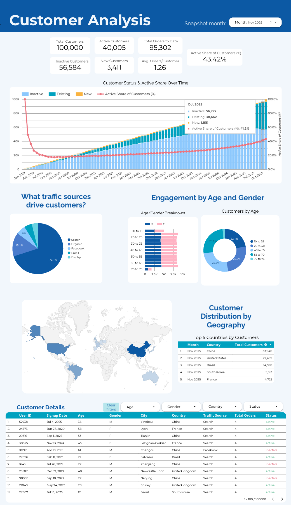
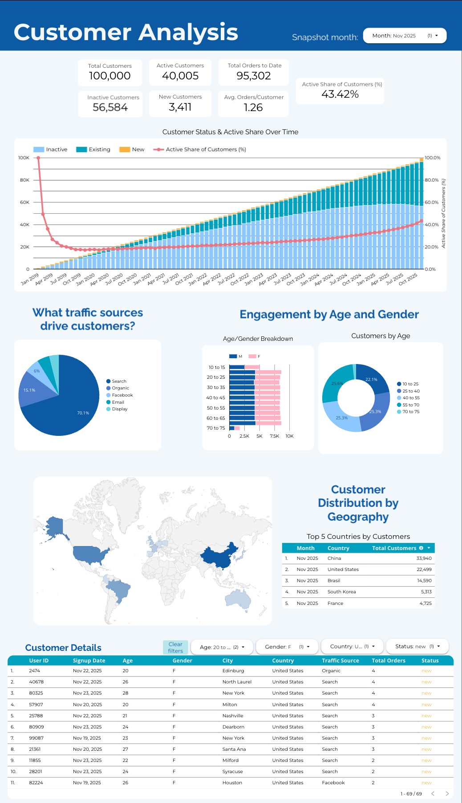

# Customer Analysis – TheLook eCommerce

Interactive **monthly customer analysis** built on Google BigQuery’s public **TheLook eCommerce** dataset.  
I modeled customer status over time (active / inactive / new), created a rolling monthly customer snapshot in BigQuery, and visualized the results in Looker Studio.

---

## Live dashboard

🔗 **Interactive report:**  
[Customer Analysis – Looker Studio](https://lookerstudio.google.com/s/rg-kbzgndl4)

---

## Dashboard preview

[Customer Analysis Dashboard (PDF)](customer_analysis_dashboard.pdf)

The main page shows a **snapshot month selector** (Nov 2025 by default) with:

- Total / Active / Inactive / New customers  
- Total orders to date & average orders per customer  
- Customer status trend (Inactive / Existing / New) with **Active Share of Customers (%)**  
- Acquisition, demographic, and geography breakdowns  
- A self-serve customer details table with filters
- **The month slicer applies to all visuals _except_ the “Customer Status & Active Share Over Time” chart and the Customer Details table.**

---

## Business questions

This project is designed to answer questions a retail / e-commerce team would care about:

1. **How many customers do we have, and how many are active vs inactive each month?**  
2. **Is our customer base actually growing, or are we just accumulating churned customers?**  
3. **Which traffic sources drive the most customers?**  
4. **What does our customer base look like by age and gender?**  
5. **Which countries contribute the most customers in a given month?**  
6. **Can stakeholders drill into specific segments (e.g., “Female customers aged 20–25 in the US who are active in Nov 2025”)?**

---

## Key findings (Nov 2025 snapshot)

- The customer base has grown to **100,000 total customers**, of which **~40% are active** and **~57% are inactive**, with **3,400+ new customers** added in Nov 2025.
- **Active share of customers is ~43%** and has stabilized in the 40–45% range after an initial drop in the early years, suggesting a mature but relatively sticky customer base.
- **Search drives ~70% of customers**, with Organic and Facebook making up most of the remaining acquisition. Display and Email contribute only a small share.
- The core customer demographic is **young adults (roughly 20–40)** with a fairly balanced gender split, indicating a broad mainstream apparel audience rather than a niche segment.
- Customer geography is highly concentrated: **China and the United States** are consistently the top two markets, followed by **Brazil, South Korea, and France**.
- The **Customer Details** explorer makes it easy to zoom into specific segments, enabling targeted retention or marketing campaigns.

---

## Key metrics & definitions

All metrics are calculated from a monthly snapshot table in BigQuery:

- **Total Customers** – distinct users in the dataset.  
- **New Customers** – customers whose signup month equals the snapshot month.  
- **Active Customers** – customers whose most recent order is within the last 12 months (as of the snapshot month).  
- **Inactive Customers** – customers who never ordered or whose last order was more than 12 months before the snapshot month.  
- **Active Share of Customers (%)**  
  \[
  \text{Active Share} = \frac{\#(\text{active} + \text{new customers})}{\#(\text{all customers in month})}
  \]
- **Total Orders to Date** – cumulative orders up to the snapshot month.  
- **Avg. Orders/Customer** – total orders to date ÷ total customers.

---

## Tech stack

- **Warehouse:** Google BigQuery  
- **Dataset:** `bigquery-public-data.thelook_ecommerce`  
- **Modeling:** StandardSQL (BigQuery)  
- **BI tool:** Looker Studio  

---

## Data source

This project uses Google’s public **TheLook eCommerce** dataset:

- Dataset: `bigquery-public-data.thelook_ecommerce`
- Tables used:
  - `bigquery-public-data.thelook_ecommerce.users`
  - `bigquery-public-data.thelook_ecommerce.orders`

TheLook is a **fictitious** online clothing store; the data is synthetic and intended for analytics demos and education.

---

## SQL pipeline

All transformation logic lives in the `sql/` directory.

### 1. `complete_customer_data.sql`

Joins `users` and `orders` into a **customer–order table**, adding:

- `signup_date`, `signup_month`  
- `order_date`, `order_quantity`  
- `most_recent_order_id`, `most_recent_order_date` per user  

→ Output: `merch-funnel.customer_analysis.complete_customer_data`

---

### 2. `monthly_customer_summary.sql`

Builds a **monthly customer snapshot**:

- One row per (`snapshot_month`, `user_id`)  
- Cumulative `total_orders` and `most_recent_order_date` as of each month  
- Flags:
  - `is_new_customer`  
  - `status` ∈ {`new`, `active`, `inactive`} based on last order date  

→ Output: `merch-funnel.customer_analysis.monthly_customer_summary`

---

### 3. `monthly_customer_kpis.sql`

Aggregates to **month-level KPIs** used in the dashboard:

- `total_customers`  
- `active_customers`, `inactive_customers`, `new_customers`  
- `active_share`  
- `total_orders_to_date`  
- `avg_orders_per_customer`  

→ Output: `merch-funnel.customer_analysis.monthly_customer_kpis`

---

## Dashboard layout

**Header & controls**

- Title: **Customer Analysis**  
- Control: `Snapshot month` (Month selector)

The `Snapshot month` control filters all visuals on the page **except**:
- **Customer Status & Active Share Over Time** – always shows the full history from Jan 2019 to the latest month.
- **Customer Details** – demonstrates the complete data and is controlled by its own filters (Age, Gender, Country, Status) rather than the snapshot month.

**KPI row**

- Total Customers  
- Active Customers  
- Inactive Customers  
- New Customers  
- Total Orders to Date  
- Avg. Orders/Customer  
- Active Share of Customers (%)

**Visuals**

1. **Customer Status & Active Share Over Time**  
   - Stacked columns: Inactive / Existing / New customers  
   - Line: Active share of customers (%)

2. **Acquisition & demographics**  
   - Pie: *What traffic sources drive customers?*  
   - Bar: Age/gender breakdown  
   - Donut: Customers by age band

3. **Geography**  
   - Map: Customer distribution by country  
   - Table: Top 5 countries by customers (for the selected month)

4. **Customer Details table**  
   - Columns: user, signup date, age, gender, city, country, traffic source, total orders, status  
   - Filters: Age, Gender, Country, Status + “Clear filters” button  

---

## Interactivity

- **Trend tooltip example**

  

- **Filtered customer segment view**

  

---

## How to reproduce

1. Create a Google Cloud project and enable **BigQuery**.  
2. Create a dataset (e.g., `merch-funnel.customer_analysis`).  
3. Run, in order:  

   - `sql/complete_customer_data.sql`  
   - `sql/monthly_customer_summary.sql`  
   - `sql/monthly_customer_kpis.sql`  

4. In Looker Studio, connect to these tables and recreate the visuals, or copy the shared report and repoint the data source to your dataset.

---

## Next steps (future work)

- Add cohort analysis (retention by signup month).  
- Build a customer funnel (browse → add to cart → purchase).  
- Layer in revenue metrics (AOV, CLV proxies) using the same modeling pattern.
